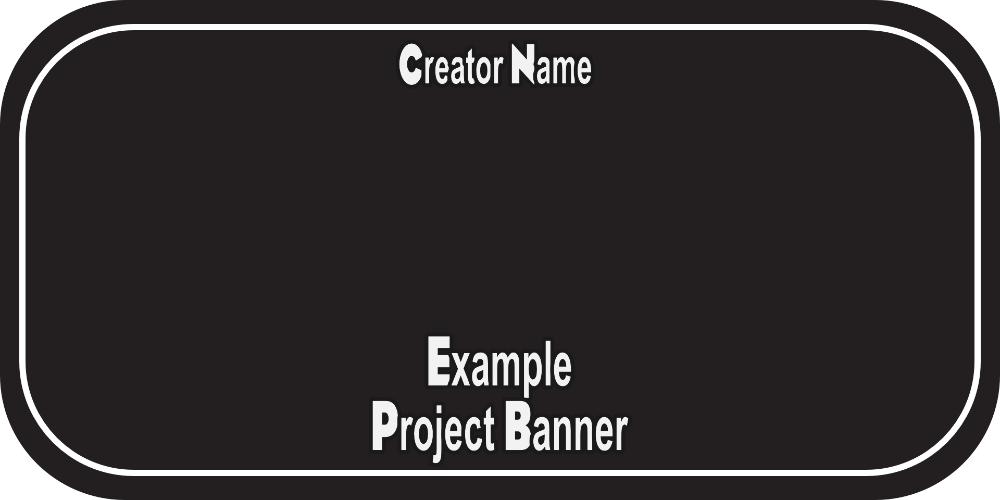

<h1 align="center">
  
</h1>

  PROJECT_NAME
   
  <a href="#about"><strong>Explore the screenshots »</strong></a>
   
   
  <a href="https://github.com/GITHUB_USERNAME/REPO_SLUG/issues/new?assignees=&labels=bug&template=01_BUG_REPORT.md&title=bug%3A+">Report a Bug</a>
  ·
  <a href="https://github.com/GITHUB_USERNAME/REPO_SLUG/issues/new?assignees=&labels=enhancement&template=02_FEATURE_REQUEST.md&title=feat%3A+">Request a Feature</a>
  .
  <a href="https://github.com/GITHUB_USERNAME/REPO_SLUG/issues/new?assignees=&labels=question&template=04_SUPPORT_QUESTION.md&title=support%3A+">Ask a Question</a>

 

  

  
  

Table of Contents

- [About](#about)
  - [Built With](#built-with)
- [Getting Started](#getting-started)
  - [Prerequisites](#prerequisites)
  - [Installation](#installation)
- [Usage](#usage)
- [Roadmap](#roadmap)
- [Support](#support)
- [Contributing](#contributing)
- [Authors \& contributors](#authors--contributors)
- [License](#license)
- [Acknowledgements](#acknowledgements)

---

## About

> **[?]**
> Provide general information about your project here.
> What problem does it (intend to) solve?
> What is the purpose of your project?
> Why did you undertake it?
> You don't have to answer all the questions -- just the ones relevant to your project.

Screenshots

 

> **[?]**
> Please provide your screenshots here.

|                                                                       |                                                                       |
| :-------------------------------------------------------------------: | :-------------------------------------------------------------------: |
|  |  |

### Built With

- [Cobra Tools](https://github.com/OpenNaja/cobra-tools) - Editing .ovl & .ms2 files
- [Blender](https://www.blender.org/) - Models
- [Affinity Photo](https://affinity.serif.com/en-us/photo/) - Media
- [SQLiteStudio](https://www.sqlitestudio.pl/) - Editing .fdb files

## Getting Started

### Prerequisites

> **[?]**
> What are the project requirements/dependencies? This can be filled in from the [list.](docs/requirements.md)

### Installation

> **[?]**
> Describe how to install and get started with the project. This can be filled in from the [list.](docs/install-instructions.md)

## Usage

Once installed, the mod will be immediately visible in your game! Take care, and please do enjoy it!

## Roadmap

See the [open issues](https://github.com/GITHUB_USERNAME/REPO_SLUG/issues) for a list of proposed features (and known issues).

- [Top Feature Requests](https://github.com/GITHUB_USERNAME/REPO_SLUG/issues?q=label%3Aenhancement+is%3Aopen+sort%3Areactions-%2B1-desc) (Add your votes using the 👍 reaction)
- [Top Bugs](https://github.com/GITHUB_USERNAME/REPO_SLUG/issues?q=is%3Aissue+is%3Aopen+label%3Abug+sort%3Areactions-%2B1-desc) (Add your votes using the 👍 reaction)
- [Newest Bugs](https://github.com/GITHUB_USERNAME/REPO_SLUG/issues?q=is%3Aopen+is%3Aissue+label%3Abug)

## Support

> **[?]**
> Provide additional ways to contact the project maintainer/maintainers.

Reach out to the maintainer at one of the following places:

- [GitHub issues](https://github.com/GITHUB_USERNAME/REPO_SLUG/issues/new?assignees=&labels=question&template=04_SUPPORT_QUESTION.md&title=support%3A+)
- Contact options listed on [this GitHub profile](https://github.com/GITHUB_USERNAME)

## Contributing

First off, thanks for taking the time to contribute! Contributions are what make the modding community such an amazing place to learn, inspire, and create. Any contributions you make will benefit everybody else and are **greatly appreciated**.

Please read [our contribution guidelines](docs/CONTRIBUTING.md), and thank you for being involved!

## Authors & contributors

The original setup of this repository is by [FULL_NAME](https://github.com/GITHUB_USERNAME).

For a full list of all authors and contributors, see [the contributors page](https://github.com/GITHUB_USERNAME/REPO_SLUG/contributors).

## License

This project is licensed under the **Creative Commons Attribution 4.0 License**.

See [LICENSE](LICENSE) for more information.

## Acknowledgements

> **[?]**
> If your work was funded by any organization or institution, acknowledge their support here.
> In addition, if your work relies on other mods or tools, or was inspired by looking at other work, it is appropriate to acknowledge this intellectual debt too.

- [The Amazing GitHub Template](https://github.com/dec0dOS/amazing-github-template), which was used to create this documentation.
- [Frontier Developments](https://www.frontier.co.uk/), who made the game.